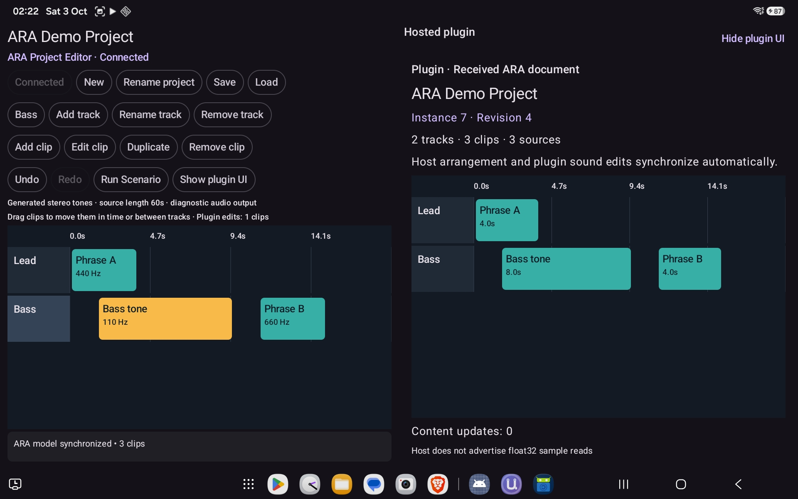

# aap-ara



Experimental AAP-native ARA extension package for Audio Plugins For Android.

This repository is intentionally separate from `aap-core` so that:

- the AAP-facing ARA API can evolve without changing the core repository layout,
- Prefab/native packaging can be shipped as its own AAR,
- any future upstream ARA SDK experiments can live here without creating licensing or dependency pressure on `aap-core`.

## Modules

- `androidaudioplugin-ara`: AAR + Prefab package containing the ARA headers, native AAPXS implementation, and C++ host runtime helpers
- `samples:aaparahostsample`: project editor using `aap::ara::HostRuntime`, with the original verification scenario available alongside editing
- `samples:aaparapluginsample`: plug-in app that exposes the ARA extension, stores the model graph in memory, and performs host-driven sample reads

## Current Sample Scope

The current sample pair is intended to prove the minimum ARA-specific path that
matters for AAP hosts:

- the host exposes the ARA host extension,
- the plug-in exposes the ARA plug-in extension,
- the host creates and destroys the ARA object graph,
- the plug-in requests prefetched audio source samples from the host outside `process()`,
- the host can notify content changes and the plug-in can reread updated samples,
- plugin-owned content edits notify the host and round-trip through modification archives.

That scope is intentionally narrower than a production DAW integration. It is
meant to validate the host/plug-in contract first.

## Sample Roadmap

The remaining example milestones are tracked in
[`docs/SAMPLE_HOST_PLAN.md`](docs/SAMPLE_HOST_PLAN.md).

## Local Development

To use the current `../aap-core` checkout, enable the included build explicitly:

```sh
./gradlew -PuseLocalAapCoreBuild=true :samples:aaparahostsample:assembleDebug :samples:aaparapluginsample:assembleDebug
```

Otherwise, dependencies are resolved via Maven repositories (including Maven Local).

The latest device verification is recorded in
[`docs/DEVICE_VERIFICATION.md`](docs/DEVICE_VERIFICATION.md).

## Project editor

Launch the standalone host sample, tap **Connect**, then **Show plugin UI** to see
the host editor and its hosted plugin together. The plugin view displays the ARA
document received by that same instance. Add, rename, move, or remove tracks and
clips in the host and observe the plugin's timeline and revision update automatically.
Source-content edits also update the content-change counter and sample-read diagnostics.
Drag a clip freely along the timeline or into another track. Positions are not
quantized; dragging previews the move and releasing commits one undoable edit.
In the hosted plugin, select a clip and choose **Edit sound** to change its
non-destructive gain. The plugin notifies the host through the reverse ARA
content-update callback. The host captures its opaque modification archive;
**Save**, **Load**, **Undo**, **Redo**, and clip duplication preserve these edits.
Completed model transactions are published as thread-safe snapshots; closing the
plugin view does not destroy the host's document or plugin instance.

The embedded UI is a Compose view served through `AudioPluginViewService` and
SurfaceControl. The sound-edit form stays inside that surface, so it works
without an activity window token. Other AAP hosts such as UAPMD and aaphostsample
can show it too; it remains empty until that host sends an ARA document. Sound editing is enabled
when the host advertises content-update support. ARA keeps arrangement properties
host-owned: the host moves clips, while the plugin changes modification content.
This follows the direction of the upstream
[ARA model update controller](https://github.com/Celemony/ARA_API/blob/main/ARAInterface.h).

The plugin app's launcher still provides a separate Compose project editor for
standalone use. Its private Binder endpoint protects its sample-read callbacks
from external hosts. The first launch provides a small two-track demo;
**New** clears it. Editing also works offline. Tap a timeline clip
to select it for editing, duplication or removal. Clip properties include the
start time, source offset, duration, destination track, tone frequency and gain.
Tracks map to ARA region sequences; each clip owns an audio source, modification
and playback region. Stable IDs survive edits and undo/redo. Source-content edits
notify the plugin to reread samples; removals destroy dependents before parents.

**Save** and **Load** use one JSON project in the host app's private storage.
Unsaved edits survive activity recreation. **Run Scenario** retains the original
pre/post-content-change sample-read verification on a separate plugin instance.
Native operations run serially off the UI thread; editing is paused while they run.
Reverse notifications enqueue work on the host; archives are fetched after the
callback returns. Host restoration never echoes a plugin-originated notification.
The experimental AAP binding now includes capability-negotiated content-update
callbacks for sources, modifications, regions and documents, and compact opaque
modification archives (up to 4 KiB). These archives are an AAP API, not a complete
implementation of the upstream ARA archive-controller interfaces.

This is a document-model editor: sources are generated stereo tones with a
60-second source length. File import, audible timeline playback and time stretching
are not implemented. Plugin audio output continues to carry diagnostic metrics so
existing host verification remains compatible. Plugin gain affects the processed
RMS display and diagnostic output; default gain preserves the original scenario.

Instrumentation tests in `ProjectEditorTest` cover JSON identity and reference
validation, multi-source content rereads after deleting another source, model
mutation/removal, and the original scenario while an editor session remains open.
Install the plugin APK before running those connected tests.

The UI uses Compose Material 3, including track lanes, clip selection, property
forms and diagnostics. `ProjectEditorComposeTest` exercises track creation,
source editing and clip deletion through the UI in both sample apps.
It also checks a free drag between tracks, gesture cancellation, and restoration.
`ProjectHostedEditorTest` requests the preferred size and attaches the embedded
surface of a real editor instance through the same service used by AAP hosts.
`ReceivedDocumentTest` checks that the plugin's Compose view receives host additions,
renames, timing edits, content changes and removal, remains attached to the same
instance while the original scenario runs, and safely handles instance destruction.
It also verifies plugin-to-host gain updates, changed diagnostic output, persisted
archives and host restoration without notification loops.
The native view test uses a non-activity context to cover hosted sound forms.
`PluginTransportTest` verifies
that processing writes only audio output ports, preserving host-injected MIDI/AAPXS
transport buffers even when they precede or separate the audio ports.
The plugin-only `PrivateWorkspaceConnectionTest` verifies that the workspace and
exported service can run their verification scenarios independently after binding
the external connection.
